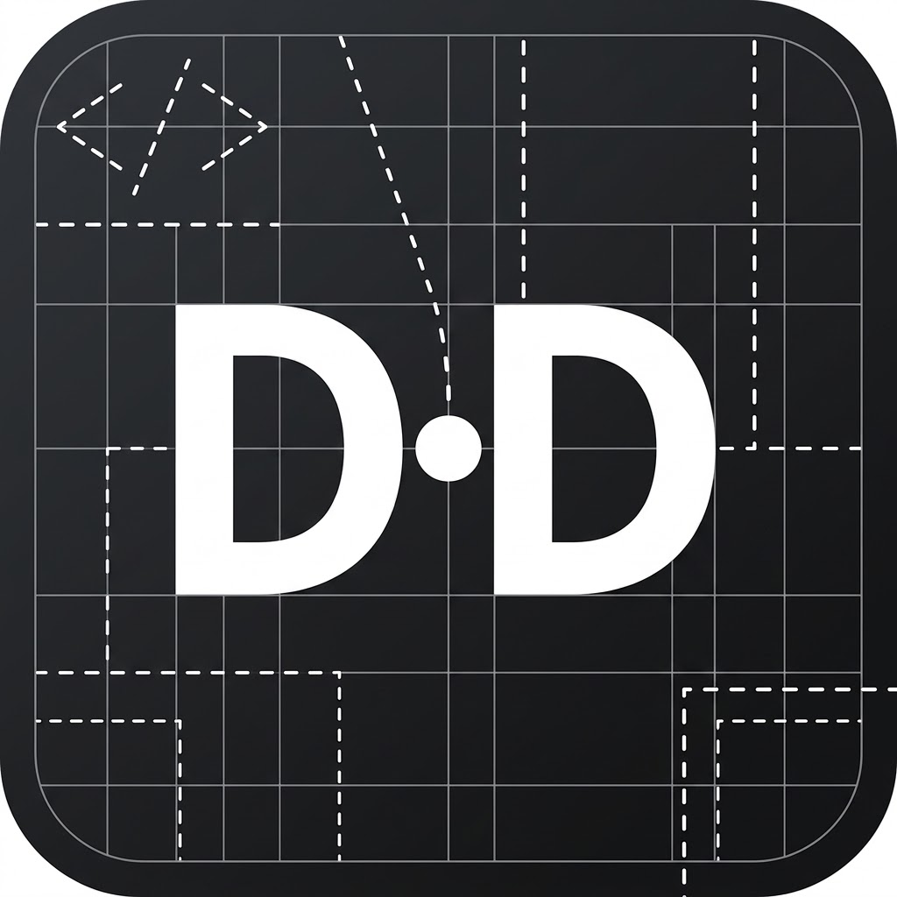

<p align="center">
  
</p>

<h1 align="center">DevDot</h1>

<p align="center">
  <strong>The Privacy-First, Zero-Telemetry Universal Developer Toolkit</strong>
  <br />
  <em>An instant, offline-first Swiss-army knife for modern developers — Part of the <strong>Cara Instan</strong> family.</em>
</p>

<p align="center">
  
  
  
  
  
  
</p>

---

## 💡 The Motivation: Why DevDot?

Have you ever:
- Pasted a **production JSON payload** with customer data into an unverified online formatter?
- Checked a **bcrypt password hash**, **JWT auth token**, or **private API key** on a random website?
- Jumped between 10 different browser tabs just to convert cURL to Python, encode Base64, generate UUIDs, and compare diffs?

### 🛑 The Problem with Web-Based Dev Tools
Most online developer utilities:
1. **Transmit your sensitive data to third-party servers** where it can be logged, scraped, or cached.
2. **Scatter your workflow** across ad-ridden, slow, and fragmented websites.
3. **Fail when you are offline** or behind strict corporate air-gapped firewalls.

### ✨ The DevDot Solution
**DevDot** was created to eliminate data leak risks once and for all. By packaging all essential daily engineering utilities into a **single, unified, privacy-guaranteed application**, your payloads never leave your computer. Everything runs **100% client-side** in your local memory.

> 🚀 **DevDot is proudly part of the [Cara Instan](https://github.com/) family** — an ecosystem dedicated to providing instant, zero-friction, and reliable solutions for developers.

---

## ⚡ Key Highlights & Architecture

- 🛡️ **100% Air-Gapped & Offline**: Zero outbound network requests, zero telemetry, zero analytics scripts.
- 🖥️ **Desktop-First Ergonomics (Tauri v2)**: Lightweight native desktop binary with instant startup and ultra-low RAM footprint.
- 📐 **Zero-Sidebar Full-Width Workspace**: Maximize code editor visibility with full-viewport split panes, an inline single-line toolbar, and on-demand slide-over navigation.
- 🔍 **TopBar Switcher & Command Palette (`Ctrl + K`)**: Switch between tools in milliseconds via dropdown or fuzzy keyboard search.
- 🗂️ **Customizable Dashboard**: Drag-and-drop tool card reordering saved automatically to your preferences.
- 💾 **State Snapshots (`.toolkit`)**: Export and restore your complete workspace state safely without cloud sync.
- 🚨 **Panic Clear & Clipboard Auto-Purge**: Flush all temporary data, storage, and clipboard history instantly.

---

## 🛠️ Tool Suites

DevDot provides a rich suite of developer utilities organized into focused categories:

```
DevDot Toolkit
├── 📄 JSON Suite
│   ├── JSON Prettify & Minify (with auto-repair)
│   ├── JSON Schema to Types (TypeScript / Go / Rust)
│   └── JSON Visual Diff (Side-by-side & Unified)
├── 🔐 Crypto & Tokens
│   ├── Offline JWT Debugger (HMAC verify & claims inspector)
│   ├── Hash & ID Generator (MD5, SHA, UUID, ULID, NanoID)
│   └── Encoder / Decoder (Base64, URL, Hex, HTML Entities)
├── 🔄 Converters & Transpilers
│   ├── cURL Converter (to Fetch, Axios, Python, Go)
│   └── Multi-Format Transpiler (JSON ⇄ YAML ⇄ TOML ⇄ CSV)
└── 🛡️ Text & Security
    └── PII Log Redactor & Sanitizer (mask sensitive credentials)
```

### 1. 📄 JSON Suite
- **Prettify & Minify**: Format with customizable indentation (2 spaces, 4 spaces, Tabs), minify into a single line, sort object keys, and auto-repair malformed JSON syntax (trailing commas, unquoted keys, single quotes).
- **Schema & Type Generator**: Transform raw JSON payloads into clean, idiomatic types:
  - TypeScript interfaces and types
  - Go `struct` definitions with JSON tags
  - Rust `struct` with Serde derives (`Serialize`, `Deserialize`)
- **Visual JSON Diff**: Compare two JSON documents side-by-side or in unified view with syntax highlighting and deep difference inspection.

### 2. 🔐 Crypto & Tokens
- **Offline JWT Debugger**: Decode and inspect JWT header, payload claims, expiration countdown timer, and verify HMAC SHA-256 signatures locally.
- **Hash & ID Generator**:
  - Cryptographic & Checksum Hashes: `MD5`, `SHA-1`, `SHA-256`, `SHA-512`.
  - Unique Identifiers: `UUIDv4`, `ULID`, `NanoID`.
- **Encoder / Decoder**: Bi-directional conversion between Base64 (text & data URI), URL Percent-encoding, Hexadecimal, and HTML entities.

### 3. 🔄 Converters & Transpilers
- **cURL Converter**: Parse raw terminal `curl` commands and convert them instantly into executable client code:
  - JavaScript `fetch()` & `axios`
  - Python `requests`
  - Go `net/http`
- **Multi-Format Transpiler**: Seamless bi-directional conversions between `JSON`, `YAML`, `TOML`, and `CSV` with structure validation.

### 4. 🛡️ Text & Security
- **PII Log Redactor & Sanitizer**: Automatically detect and mask sensitive information from production logs, payloads, and traces (Emails, Credit Cards, IPv4/IPv6, Bearer tokens, API keys, Passwords).

---

## 🧰 Tech Stack

| Layer | Technology |
| :--- | :--- |
| **Desktop Runtime** | [Tauri v2](https://tauri.app/) (Rust-powered native shell) |
| **Frontend Framework** | [Vue 3](https://vuejs.org/) (Composition API, `<script setup>`) |
| **Build Tooling** | [Vite 6](https://vitejs.dev/) + [TypeScript](https://www.typescriptlang.org/) |
| **State Management** | [Pinia](https://pinia.vuejs.org/) |
| **Code Editor** | [CodeMirror 6](https://codemirror.net/) (with Multi-language grammar & One Dark theme) |
| **UI & Icons** | Material 3 Web Components + [Lucide Icons](https://lucide.dev/) |
| **PWA & Offline Engine** | Vite Plugin PWA + Workbox Cache |

---

## 🚀 Getting Started

### Prerequisites
- **Node.js** >= `18.0.0`
- **npm** >= `9.0.0`
- *(Optional for Desktop Build)* **Rust & Cargo** (for Tauri v2): [Install Rust](https://www.rust-lang.org/tools/install)

### 1. Clone & Install Dependencies
```bash
git clone https://github.com/your-username/devtoys-dot.git
cd devtoys-dot

# Install NPM dependencies
npm install
```

### 2. Run Development Server (Web Engine)
```bash
npm run dev
```
Open your browser at `http://localhost:5173`.

### 3. Run Native Desktop App (Tauri)
```bash
npm run tauri dev
```

### 4. Production Build
```bash
# Build web bundle
npm run build

# Build native desktop installer (.msi / .exe / .dmg / .deb)
npm run tauri build
```

---

## 🧪 Verification & Test Suites

DevDot includes standalone verification scripts to ensure mathematical correctness, parsing accuracy, and privacy guarantees across all modules:

```bash
# Verify JSON formatter, auto-repair & schema generator
npm run test:json

# Verify JSON visual diff engine
npm run test:diff

# Verify Crypto, JWT, Hash & ID generators
npm run test:crypto

# Verify cURL & Multi-format transpilers (YAML, TOML, CSV)
npm run test:converters

# Verify PII Log Redactor rules & masking
npm run test:redactor

# Verify Snapshot state export/import engine (.toolkit)
npm run test:snapshot

# Verify Panic Clear & Security controls
npm run test:security

# Verify PWA Offline service worker
npm run test:pwa
```

---

## ⌨️ Keyboard Shortcuts

| Shortcut | Action |
| :--- | :--- |
| `Ctrl + K` / `Cmd + K` | Open Quick Command Palette |
| `Ctrl + /` / `Cmd + /` | Toggle Navigation Drawer Flyout |
| `Ctrl + Shift + S` | Open Snapshot Backup Dialog |
| `Escape` | Close active modal / flyout / dialog |

---

## 🔒 Privacy Guarantee

```
                    ┌────────────────────────────┐
                    │      Your Workstation      │
                    │                            │
  [ Sensitive Data ] ──▶ [ DevDot Local Memory ]  │
                    │        (Air-Gapped)        │
                    └─────────────┬──────────────┘
                                  │
                                  ▼
                         [ Output Result ]
                      (Zero Outbound Traffic)
```

1. **Zero External API Calls**: DevDot does not make any network requests to external servers.
2. **No Analytics / Telemetry**: No tracking pixels, Google Analytics, Sentry, or user session recording.
3. **Local Storage Control**: All preferences and tool order states remain exclusively in your local `localStorage`.
4. **Panic Button**: Instantly wipe all local storage, cached states, and clipboard memory with a single click in Settings.

---

## 🤝 Contributing & Cara Instan Ecosystem

Contributions, feature suggestions, and bug reports are warmly welcome!

1. Fork the repository
2. Create your feature branch (`git checkout -b feature/amazing-tool`)
3. Commit your changes (`git commit -m 'feat: add amazing tool'`)
4. Run test suites (`npm run build`)
5. Push to the branch (`git push origin feature/amazing-tool`)
6. Open a Pull Request

---

## 📄 License

This project is open-source software licensed under the **MIT License** — see the [LICENSE](LICENSE) file for details.

<p align="center">
  Made with ❤️ for developers by the <strong>Cara Instan</strong> team.
</p>
