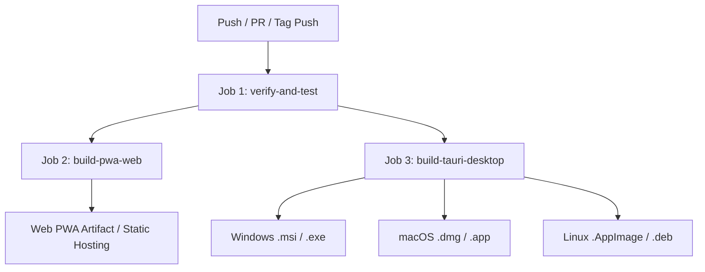

# DevDot CI/CD & Offline Deployment Documentation

Dokumen ini menjelaskan arsitektur CI/CD, konfigurasi Progressive Web App (PWA) 100% offline, dan pipeline release otomatis multi-platform (Web SPA, Windows, macOS, Linux) menggunakan **GitHub Actions** dan **Tauri v2**.

---

## 1. Ikhtisar Pipeline CI/CD

Workflow otomatis terdefinisi di [`.github/workflows/ci-cd.yml`](../.github/workflows/ci-cd.yml) dan terbagi menjadi 3 job terisolasi:



### 1.1 Job 1: `verify-and-test`
Menjalankan static typechecking dan seluruh rangkaian uji verifikasi modular untuk menjamin tidak ada regresi fungsionalitas:
1. **TypeScript Typecheck**: `npx vue-tsc -b`
2. **JSON Suite Tests**: Formatter, Minifier, Repair, Schema/Type Gen (`npm run test:json`)
3. **JSON Diff Tests**: Side-by-side & unified diff viewer (`npm run test:diff`)
4. **Crypto & Hashes**: Base64, URL, Hex, MD5, SHA, HMAC, UUID/ULID (`npm run test:crypto`)
5. **Converters**: Bi-directional JSON/YAML/TOML/CSV & cURL (`npm run test:converters`)
6. **PII Redactor**: Regex patterns masking (`npm run test:redactor`)
7. **Snapshot Engine**: Schema validation v1.0.0, `.toolkit` import/export (`npm run test:snapshot`)
8. **Security & Ephemeral Scrubbing**: Zero network calls, clipboard purge (`npm run test:security`)
9. **Desktop Native Integrations**: Tauri dialog, FS, global shortcuts (`npm run test:native`)
10. **PWA & Offline Service Worker**: Manifest, SW cache-first config (`npm run test:pwa`)

### 1.2 Job 2: `build-pwa-web`
- Menjalankan `npm run build` untuk memproduksi static web distribution di folder `dist/`.
- Memvalidasi keberadaan Service Worker (`dist/sw.js`) dan Manifest (`dist/manifest.webmanifest`).
- Mengunggah artifact `devdot-web-pwa` yang siap di-deploy ke GitHub Pages, Vercel, Cloudflare Pages, atau server static offline.

### 1.3 Job 3: `build-tauri-desktop` (Matrix Build)
- Melakukan build native cross-platform untuk target:
  - **Windows (x64)**: `x86_64-pc-windows-msvc` (memproduksi installer `.msi` dan `.exe`)
  - **macOS (Universal)**: `universal-apple-darwin` (memproduksi `.dmg` dan bundle `.app`)
  - **Linux (x64)**: `x86_64-unknown-linux-gnu` (memproduksi `.AppImage` dan `.deb`)
- Menggunakan `tauri-apps/tauri-action@v0` untuk otomatis membuat GitHub Release draft jika ada push tag `v*.*.*`.

---

## 2. Progressive Web App (PWA) & Strategi Offline 100%

### 2.1 Konfigurasi Service Worker (Workbox Cache-First)
DevDot menggunakan plugin `vite-plugin-pwa` dengan strategi cache-first untuk menjamin prinsip **Zero Outbound Data** dan **100% Air-Gapped Offline Execution**:

```typescript
// vite.config.ts
VitePWA({
  registerType: 'autoUpdate',
  includeAssets: ['favicon.svg', 'robots.txt', 'pwa-192x192.svg', 'pwa-512x512.svg', 'pwa-maskable.svg'],
  manifest: {
    name: 'DevDot - Privacy-First Universal Developer Toolkit',
    short_name: 'DevDot',
    display: 'standalone',
    theme_color: '#1e1b4b',
    background_color: '#0f172a'
    // ...
  },
  workbox: {
    globPatterns: ['**/*.{js,css,html,ico,png,svg,json,woff,woff2}'],
    maximumFileSizeToCacheInBytes: 10485760, // 10MB limit
    cleanupOutdatedCaches: true,
    navigateFallback: 'index.html'
  }
})
```

### 2.2 Lifecycle & Reactive PWA Store (`src/stores/pwa.ts`)
- **Event `beforeinstallprompt`**: Ditangkap secara otomatis untuk menampilkan tombol M3 *Install App* pada Top App Bar dan *PwaInstallBanner*.
- **Event `appinstalled`**: Mendeteksi saat aplikasi telah terpasang ke OS dan menyembunyikan prompt instalasi.
- **Offline / Online State**: Terintegrasi reaktif dengan Pinia store untuk mendeteksi perubahan status jaringan perangkat pengguna.

---

## 3. Konfigurasi GitHub Repository Secrets

Untuk mengaktifkan automated signing & release pada Tauri desktop builds, tambahkan secrets berikut di GitHub Repository Settings (`Settings > Secrets and variables > Actions`):

| Secret Name | Deskripsi | Wajib / Opsional |
|---|---|---|
| `GITHUB_TOKEN` | Otomatis disediakan oleh GitHub Actions untuk membuat release draft | Otomatis |
| `TAURI_SIGNING_PRIVATE_KEY` | Private key untuk auto-updater code signing Tauri v2 | Opsional (jika updater aktif) |
| `TAURI_SIGNING_PRIVATE_KEY_PASSWORD` | Password untuk private key code signing | Opsional |

---

## 4. Cara Menjalankan Release Manual

### 4.1 Memicu Build Release via Git Tag
1. Pastikan seluruh tests lokal berhasil:
   ```bash
   npm run build
   ```
2. Buat tag release baru:
   ```bash
   git tag v0.1.0
   git push origin v0.1.0
   ```
3. GitHub Actions akan otomatis memicu workflow `ci-cd.yml` dan menghasilkan Release Draft beserta installer installer biner untuk seluruh OS di tab GitHub Releases.

### 4.2 Build & Preview PWA Lokal
Untuk memverifikasi Service Worker dan PWA secara lokal:
```bash
npm run build
npm run preview
```
Buka browser pada `http://localhost:4173/`, buka DevTools -> Application -> Service Workers & Manifest untuk memverifikasi status registered dan cache-first storage.
