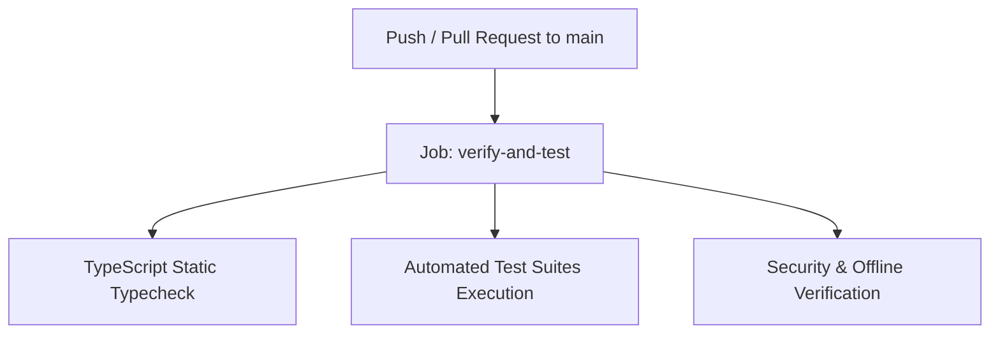

# DevDot CI & Offline Deployment Documentation

Dokumen ini menjelaskan konfigurasi CI (Continuous Integration) untuk pengujian otomatis, Progressive Web App (PWA) 100% offline, serta prosedur build lokal untuk Web SPA dan Tauri desktop multi-platform.

---

## 1. Ikhtisar Pipeline CI (Testing & Verification)

Workflow otomatis terdefinisi di [`.github/workflows/ci-cd.yml`](../.github/workflows/ci-cd.yml) dan difokuskan khusus untuk **pengujian dan verifikasi kualitas kode** pada setiap push/pull request ke branch `main`:



### 1.1 Job: `verify-and-test`
Menjalankan static typechecking dan seluruh rangkaian uji verifikasi modular untuk menjamin tidak ada regresi fungsionalitas:
1. **TypeScript Typecheck**: `npx vue-tsc -b`
2. **JSON Suite Tests**: Formatter, Minifier, Repair, Schema/Type Gen (`npm run test:json`)
3. **JSON Diff Tests**: Side-by-side & unified diff viewer (`npm run test:diff`)
4. **Crypto & Hashes**: Base64, URL, Hex, MD5, SHA, HMAC, UUID/ULID (`npm run test:crypto`)
5. **Converters**: Bi-directional JSON/YAML/TOML/CSV & cURL (`npm run test:converters`)
6. **PII Redactor**: Regex patterns masking (`npm run test:redactor`)
7. **Snapshot Engine**: Schema validation v1.0.0, `.toolkit` import/export (`npm run test:snapshot`)
8. **Security & Ephemeral Scrubbing**: Zero network calls, clipboard purge (`npm run test:security`)
9. **Desktop Native Integrations**: Tauri dialog, FS, global shortcuts (`npm run test:native`)
10. **PWA & Offline Service Worker**: Manifest, SW cache-first config (`npm run test:pwa`)

---

## 2. Progressive Web App (PWA) & Strategi Offline 100%

### 2.1 Konfigurasi Service Worker (Workbox Cache-First)
DevDot menggunakan plugin `vite-plugin-pwa` dengan strategi cache-first untuk menjamin prinsip **Zero Outbound Data** dan **100% Air-Gapped Offline Execution**:

```typescript
// vite.config.ts
VitePWA({
  registerType: 'autoUpdate',
  includeAssets: ['favicon.svg', 'robots.txt', 'pwa-192x192.svg', 'pwa-512x512.svg', 'pwa-maskable.svg'],
  manifest: {
    name: 'DevDot - Privacy-First Universal Developer Toolkit',
    short_name: 'DevDot',
    display: 'standalone',
    theme_color: '#1e1b4b',
    background_color: '#0f172a'
    // ...
  },
  workbox: {
    globPatterns: ['**/*.{js,css,html,ico,png,svg,json,woff,woff2}'],
    maximumFileSizeToCacheInBytes: 10485760, // 10MB limit
    cleanupOutdatedCaches: true,
    navigateFallback: 'index.html'
  }
})
```

### 2.2 Lifecycle & Reactive PWA Store (`src/stores/pwa.ts`)
- **Event `beforeinstallprompt`**: Ditangkap secara otomatis untuk menampilkan tombol M3 *Install App* pada Top App Bar dan *PwaInstallBanner*.
- **Event `appinstalled`**: Mendeteksi saat aplikasi telah terpasang ke OS dan menyembunyikan prompt instalasi.
- **Offline / Online State**: Terintegrasi reaktif dengan Pinia store untuk mendeteksi perubahan status jaringan perangkat pengguna.

---

## 3. Cara Build & Release Lokal Mandiri

Build produksi dilakukan secara mandiri di mesin lokal:

### 3.1 Build & Preview PWA Web (SPA)
Untuk memproduksi dan memverifikasi bundle web PWA secara lokal:
```bash
# Build static distribution
npm run build

# Preview static server lokal
npm run preview
```
Buka browser pada `http://localhost:4173/`, buka DevTools -> Application -> Service Workers & Manifest untuk memverifikasi status registered dan cache-first storage.

### 3.2 Build Aplikasi Desktop (Tauri)
Untuk memproduksi biner native executable / installer desktop:
```bash
# Development mode dengan hot-reload
npm run tauri dev

# Production standalone build (installer .msi/.exe di Windows, .dmg di macOS, .AppImage/.deb di Linux)
npm run tauri build
```
Hasil installer biner akan tersedia di direktori `src-tauri/target/release/bundle/`.
